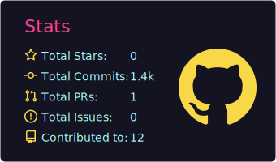
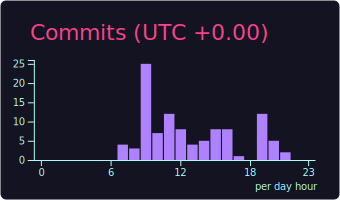

# Hi 👋, I'm Aditya Roushan

### A final-year UG student at IIT KGP and passionate about AI/ML

  

  

  

- 🔭 I'm currently working on **AI Automation**

- 🌱 I'm currently learning **Multi-Agentic System**

- 💬 Ask me about **Machine Learning, Deep Learning, Generative AI**

- 📫 How to reach me **roushanaditya193@gmail.com**

- ⚡ Fun fact **If it’s repetitive, I try to automate it.**

- 📄 Know about my experiences **[https://drive.google.com/file/d/12VElxLGgT0_uguGwD5foAZAd3PR_V3Ne/view?usp=sharing](https://drive.google.com/file/d/12VElxLGgT0_uguGwD5foAZAd3PR_V3Ne/view?usp=sharing)**

<h3 align="left">Connect with me:</h3>

<h3 align="left">Languages and Tools:</h3>

                       

<h3 align="left">Stats:</h3>

  

  
  

